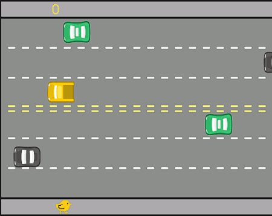

# Jogos clássicos parte 2 - laços e listas

## Game-Freeway 🐣 - Exercitando lógica de programação

Jogo eletrônico de ação antigo do Atari, onde o jogador controlava uma galinha que deveria atravessar uma rodovia cheia de automóveis e de caminhões, com mais de seis pistas. Um jogo simples lançado para o Atari 2600 em 1981.

## Nesse projeto utilizei: 

    
      
   
   
  Utilizei um editor de texto online chamado [P5](https://p5js.org/)
  

    
## Preview

    
    

